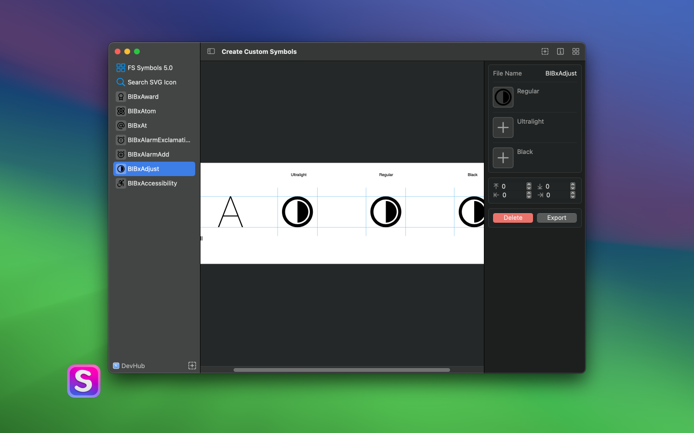
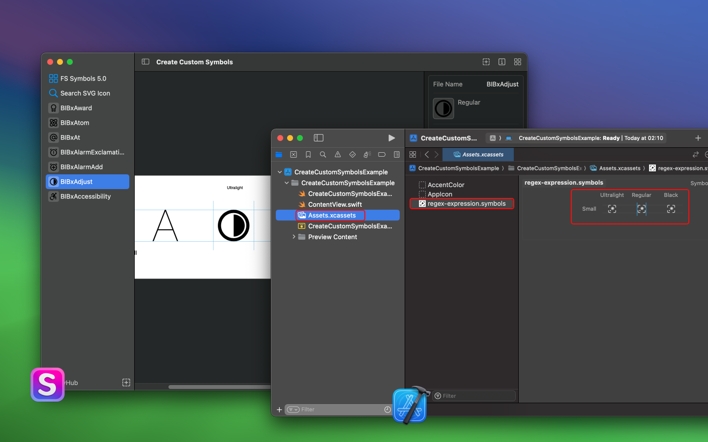

<div align="center">
  <br />
  <br />
  
  <p>
    <a href="./README.zh.md">中文</a> • 
    <a href="#frequently-asked-questions">FAQ</a> • 
    <a href="https://wangchujiang.com/#/contact">Contact & Support</a> • 
    <a href="https://github.com/jaywcjlove/create-custom-symbols/releases">Changelog</a>
  </p>
  <h1>Create Custom Symbols</h1>
  <!--rehype:style=border: 0;-->
  <p>
    <a target="_blank" href="https://apps.apple.com/app/create-custom-symbols/id6476924627" title="Create Custom Symbols AppStore"></a>
  </p>
</div>

A tool that can convert any SVG icon into a [custom SF symbol](https://developer.apple.com/documentation/uikit/uiimage/creating_custom_symbol_images_for_your_app). Your customized SF symbol can be imported into Xcode and utilized in any project based on UIKit or SwiftUI.



Effortlessly convert any SVG icon into an SF symbol file usable in Xcode by simply dragging and dropping the icon, enabling swift creation of SF symbol files.



Support batch import of SVG icons and batch generation of SF symbol icons.


## Frequently Asked Questions

#### How to Use Your Custom SF Symbol in SwiftUI?

```swift
// Your custom symbol at Medium scale, Regular weight
Image("myCustomSymbolName")

// Your custom symbol at large scale, 21pt font and Heavy weight
Image("myCustomSymbolName")
    .imageScale(.large)
    .font(Font.system(size: 21, weight: .heavy))
```

You can also display custom symbols alongside some text.

```swift
VStack {
    (Text("Some Text ")
        + Text(Image("myCustomSymbolName"))
        + Text(" more text")).imageScale(.large)
}
```

#### How to Use Your Custom SF Symbol in UIKit?

```swift
let customSymbol:UIImage? = UIImage(named: "MyCustomSymbolName")?
    .applyingSymbolConfiguration(
        UIImage.SymbolConfiguration(
            pointSize: 17,
            weight: .semibold,
            scale: .large
        )
    )
```

#### How to Use Your Custom SF Symbol in AppKit?

```swift
let customSymbol:NSImage? = NSImage(named: "MyCustomSymbolName")?
    .withSymbolConfiguration(
        NSImage.SymbolConfiguration(
            pointSize: 24,
            weight: .bold,
            scale: .large
        )
    )
```

Apply a specific appearance to a symbol image

```swift
var configuration = NSImage.SymbolConfiguration(paletteColors: [.systemTeal, .systemGray])
configuration = config.applying(.init(textStyle: .title1))
imageView.symbolConfiguration = config
```

#### How to Use Your Custom SF Symbol in UIKit?

```swift
// Create a system symbol image.
let image = UIImage(systemName: "multiply.circle.fill")                  

// Create a custom symbol image using an asset in an asset catalog in Xcode.
let image = UIImage(named: "custom.multiply.circle")
```

#### How to add custom SF symbols to a string?

```swift
Text("Use \(Image("myCustomSymbolName")) to crop the image")
```

#### How to define colorful SF symbols?

Currently not supported, according to the [official documentation](https://developer.apple.com/documentation/uikit/uiimage/creating_custom_symbol_images_for_your_app), manually adding styles, still trying to support it in the future.

```html
<style>
  .multicolor-0:systemBlueColor { fill:#007AFF; opacity:1.0 }
  .multicolor-1:white { fill:#FFFFFF; opacity:1.0 }
  .multicolor-2:tintColor { fill:#007AFF; opacity:1.0 }
  .hierarchical-0:tertiary { fill:#8E8E8E }
  .hierarchical-1:primary { fill:#212121 }
</style>

<g id="Symbols">
  <!-- A variant containing three shapes with multicolor and hierarchical annotations. -->
  <g id="Regular-M" transform="matrix(1 0 0 1 2853.78 1556)">
      <!-- The shape is in the first multicolor layer, whose fill color is systemBlueColor. It’s also in the first layer for hierarchical rendering, and the level is primary. -->
      <path class="multicolor-0:systemBlueColor hierarchical-1:primary" d="...">
  
      <!-- Two additional shapes. -->
      <path class="multicolor-1:white hierarchical-1:primary" d="...">
      <path class="multicolor-2:tintColor hierarchical-0:tertiary" d="...">
    </g>
</g>
```

### [More FAQs…](https://github.com/jaywcjlove/create-custom-symbols/issues)

<!--idoc:config:
site: Create Custom Symbols
title: Copybook Generator is a tool that can convert any SVG icon into a custom SF symbol - 
description: A tool that can convert any SVG icon into a custom SF symbol. Your customized SF symbol can be imported into Xcode and utilized in any project based on UIKit or SwiftUI
keywords: sfsymbol,svg,symbol,custom symbol,create custom symbols
-->