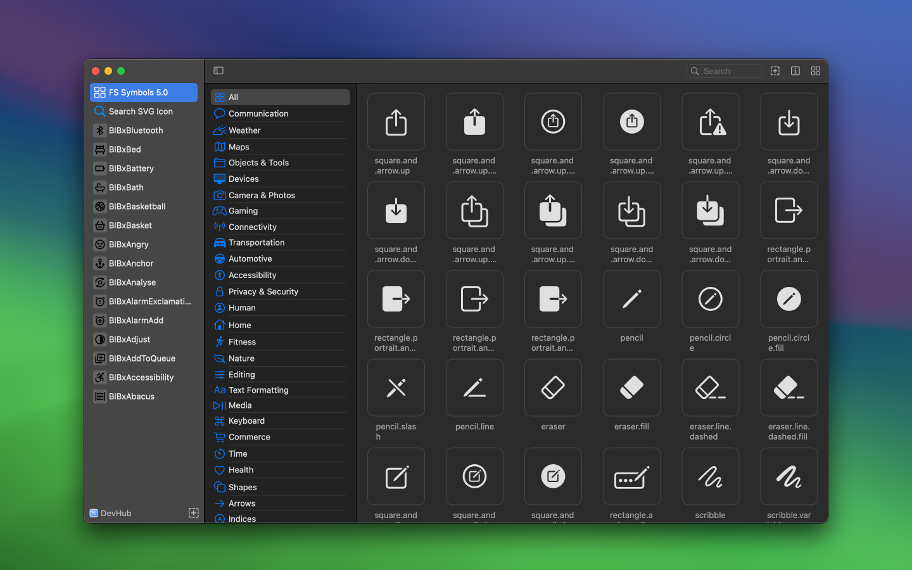
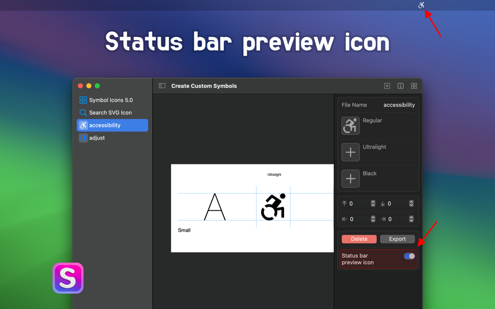
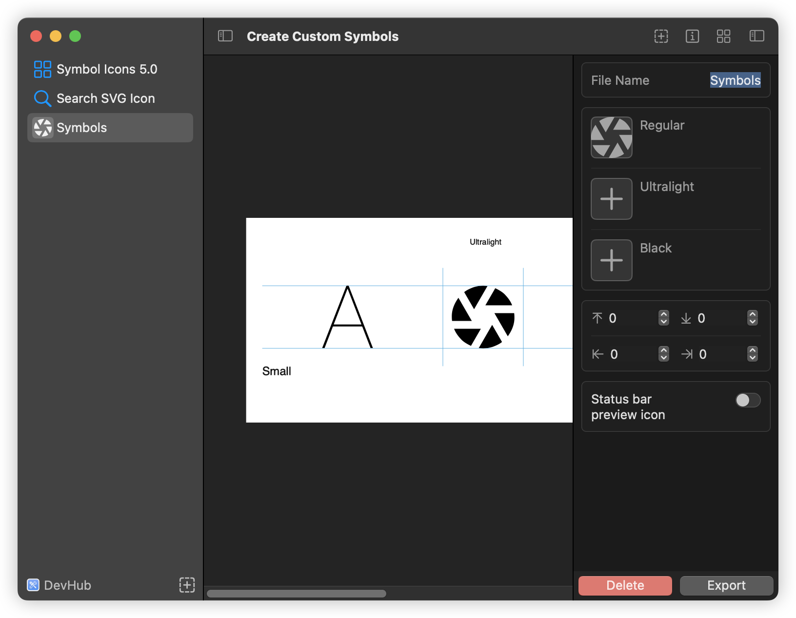
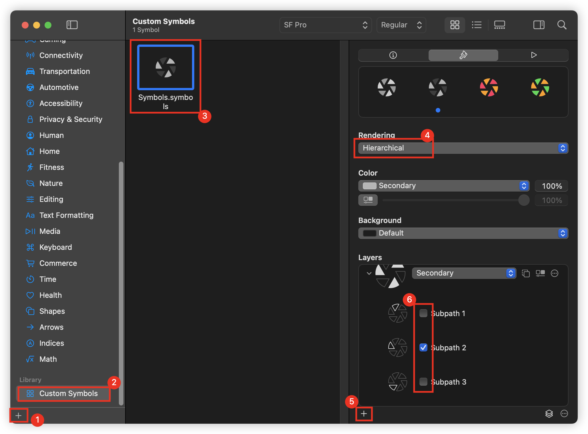
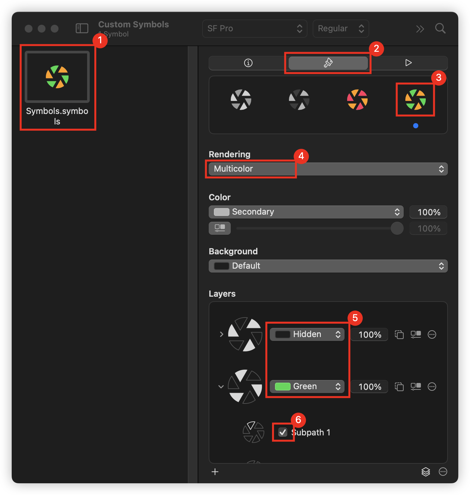
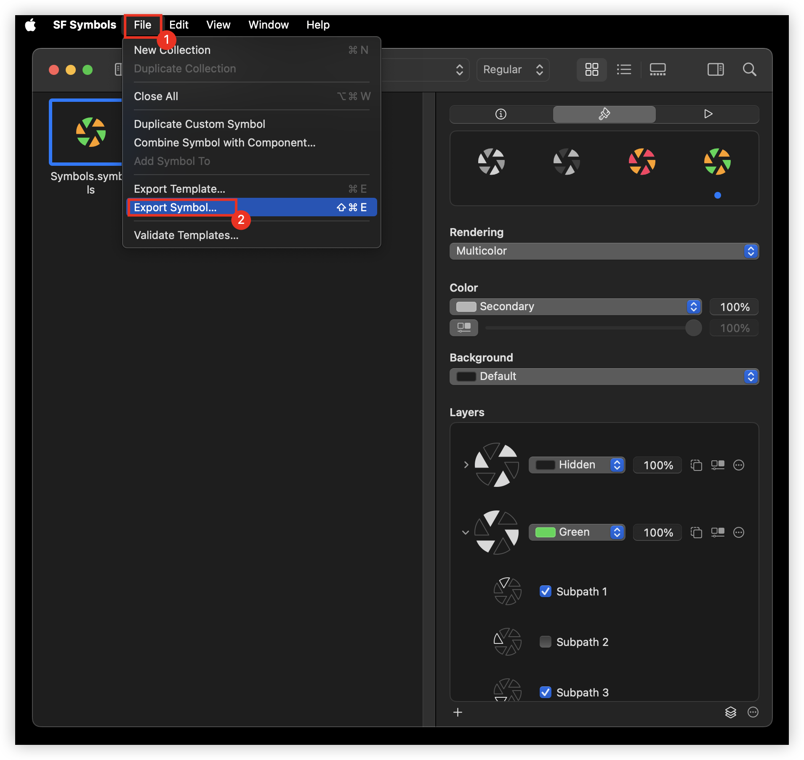

<!--idoc:ignore:start-->
> [!TIP]
> 声明：此项目并非开源，仓库作为官方网站，用于收集问题和用户需求。这样做是为了节省成本，因为没有官网，应用无法通过审核。
<!--idoc:ignore:end-->

<div align="center">
  <br />
  <br />
  
  <h1>Create Custom Symbols</h1>
  <!--rehype:style=border: 0;-->
  <p>
    <a href="./README.md">English</a> • 
    <a href="#常见问题">常见问题</a> • 
    <a target="_blank" href="https://wangchujiang.com/#/contact">联系&支持</a> • 
    <a href="./CHANGELOG.zh.md">更新日志</a>
  </p>
  <p>
    <a target="_blank" href="https://apps.apple.com/app/create-custom-symbols/id6476924627" title="Create Custom Symbols AppStore"></a>
  </p>
</div>

一个工具，能够将任意 SVG 图标转换为[自定义的 SF 符号](https://developer.apple.com/documentation/uikit/uiimage/creating_custom_symbol_images_for_your_app)。您可以将定制的 SF 符号导入 Xcode，并在任何基于 UIKit 或 SwiftUI 的项目中使用。


通过拖放，将任何 SVG 图标轻松转换为可在 Xcode 中使用的 SF 符号文件，快速创建 SF 符号文件。


支持批量导入 SVG 图标，并批量生成 SF 符号图标






## 常见问题

### 如何在 SwiftUI 中使用您的自定义 SF 符号？

```swift
// Your custom symbol at Medium scale, Regular weight
Image("myCustomSymbolName")

// Your custom symbol at large scale, 21pt font and Heavy weight
Image("myCustomSymbolName")
    .imageScale(.large)
    .font(Font.system(size: 21, weight: .heavy))
```

您还可以在一些文本旁边显示自定义符号。

```swift
VStack {
    (Text("Some Text ")
        + Text(Image("myCustomSymbolName"))
        + Text(" more text")).imageScale(.large)
}
```

### 如何在 UIKit 中使用您的自定义 SF 符号？

```swift
let customSymbol:UIImage? = UIImage(named: "MyCustomSymbolName")?
    .applyingSymbolConfiguration(
        UIImage.SymbolConfiguration(
            pointSize: 17,
            weight: .semibold,
            scale: .large
        )
    )
```

### 如何在 AppKit 中使用您的自定义 SF 符号？

```swift
let customSymbol:NSImage? = NSImage(named: "MyCustomSymbolName")?
    .withSymbolConfiguration(
        NSImage.SymbolConfiguration(
            pointSize: 24,
            weight: .bold,
            scale: .large
        )
    )
```

为符号图像应用特定外观

```swift
var configuration = NSImage.SymbolConfiguration(
    paletteColors: [.systemTeal, .systemGray]
)
configuration = config.applying(.init(textStyle: .title1))
imageView.symbolConfiguration = config
```

### 如何在 UIKit 中使用您的自定义 SF 符号？

```swift
// Create a system symbol image.
let image = UIImage(systemName: "multiply.circle.fill")                  

// Create a custom symbol image using an asset in an asset catalog in Xcode.
let image = UIImage(named: "custom.multiply.circle")
```

### 如何将自定义 SF 符号添加到字符串中？

```swift
Text("使用 \(Image("myCustomSymbolName")) 裁剪图像")
```

### 如何定义多彩 SF 符号？

目前暂时不支持，根据[官方文档](https://developer.apple.com/documentation/uikit/uiimage/creating_custom_symbol_images_for_your_app)手动去添加样式，仍然在未来尝试支持它

```html
<style>
  .multicolor-0:systemBlueColor { fill:#007AFF; opacity:1.0 }
  .multicolor-1:white { fill:#FFFFFF; opacity:1.0 }
  .multicolor-2:tintColor { fill:#007AFF; opacity:1.0 }
  .hierarchical-0:tertiary { fill:#8E8E8E }
  .hierarchical-1:primary { fill:#212121 }
</style>

<g id="Symbols">
  <!-- 包含三种形状的变体，具有多色和分层注释。 -->
  <g id="Regular-M" transform="matrix(1 0 0 1 2853.78 1556)">
      <!-- 形状位于第一个多色图层中，其填充颜色为 systemBlueColor。
        它也位于分层渲染的第一个图层中，层级为一级。-->
      <path
        class="multicolor-0:systemBlueColor hierarchical-1:primary" d="..."
      />
  
      <!-- 两个额外的形状。 -->
      <path class="multicolor-1:white hierarchical-1:primary" d="...">
      <path class="multicolor-2:tintColor hierarchical-0:tertiary" d="...">
    </g>
</g>
```

### 如何为自定义符号启用多色支持？

感谢 [@ldowens](https://github.com/jaywcjlove/create-custom-symbols/issues/9) 提供的方法，帮助我们实现自定义符号的多色支持。

#### 步骤 1：创建并导出符号  

在 **Create Custom Symbols** 应用中，使用 **SVG** 创建一个新的符号，并将其导出。  



#### 步骤 2：导入 SF Symbols 并设置颜色  

将导出的 **Symbols.symbols.svg** 文件拖拽到 **SF Symbols** 应用中，并创建层。  

  

按照以下步骤设置自定义符号的颜色：  

  

#### 步骤 3：导出多色符号  

完成颜色设置后，在 **SF Symbols** 应用中导出符号图标。  

  

### [更多问题...](https://github.com/jaywcjlove/create-custom-symbols/issues)

<!--idoc:config:
site: 创建自定义符号
title: 创建自定义符号一个可以将任何 SVG 图标转换为自定义 SF 符号的工具 - 
description: 一个可以将任何 SVG 图标转换为自定义 SF 符号的工具
keywords: sfsymbol,svg,symbol,custom symbol,符号,自定义符号,svg符号,创建自定义符号
-->